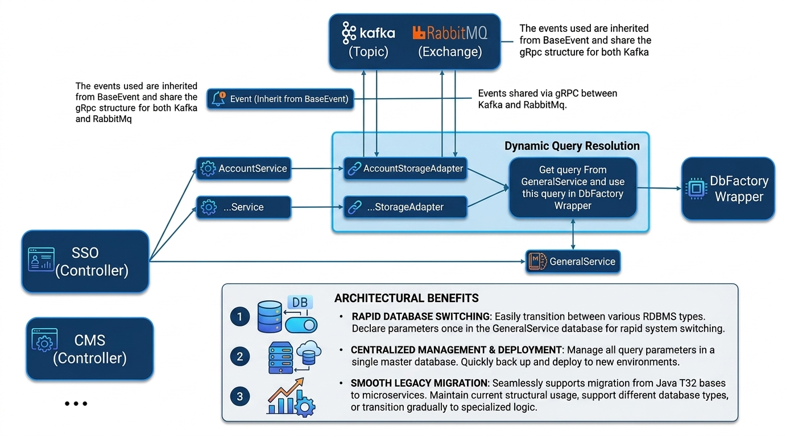
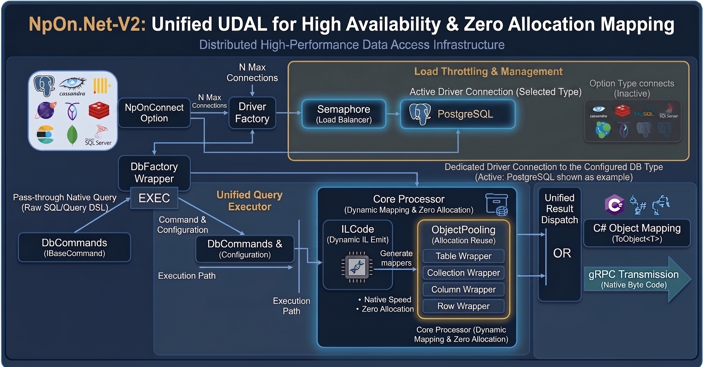

# NpOn.Net-V2: Hệ thống Backend AIoT Hiệu năng cao

Chào mừng bạn đến với **NpOn.Net-V2**, một nền tảng backend hiện đại được xây dựng trên .NET 10, tập trung vào khả năng mở rộng, tính sẵn sàng cao và tối ưu hóa tài nguyên thông qua kiến trúc Unified UDAL.

---

## 🏗️ Kiến trúc Hệ thống

Dưới đây là mô tả chi tiết về cách hệ thống vận hành và xử lý dữ liệu.

### 1. Luồng Dịch vụ (Service Flow)
Hệ thống được thiết kế theo mô hình Microservices với khả năng mở rộng linh hoạt.



*   **Controllers (SSO/CMS)**: Đóng vai trò là cổng vào (Gateway), tiếp nhận yêu cầu từ người dùng.
*   **AccountService**: Quản lý định danh, xác thực và phân quyền.
*   **GeneralService**: Dịch vụ trung tâm cung cấp các cấu hình truy vấn và logic nghiệp vụ chung.
*   **Dynamic Query Resolution**: Một lớp trung gian giúp phân giải các câu lệnh truy vấn động một cách an toàn và hiệu quả trước khi gửi tới database.
*   **Event-Driven Architecture**: Sử dụng **Kafka** và **RabbitMQ** để truyền tin (Event) giữa các service, đảm bảo tính bất đồng bộ và khả năng chịu lỗi.

### 2. Hạ tầng Truy cập Dữ liệu (Unified UDAL)
Hệ thống sử dụng lớp truy cập dữ liệu hợp nhất (Unified Data Access Layer) giúp đạt hiệu năng tối đa.



*   **Driver Factory**: Hỗ trợ đa dạng các loại RDBMS (PostgreSQL, SQL Server, MySQL, Cassandra, v.v.) giúp chuyển đổi database dễ dàng mà không cần thay đổi code nghiệp vụ.
*   **Load Throttling**: Sử dụng **Semaphore** để kiểm soát tải trọng kết nối, ngăn ngừa tình trạng quá tải DB.
*   **Core Processor (Zero Allocation)**: 
    *   Sử dụng **Dynamic IL Emit (ILCode)** để sinh mã mapping trực tiếp tại thời điểm chạy.
    *   Áp dụng **Object Pooling** để tái sử dụng các wrapper (Table, Collection, Row), giúp đạt tốc độ xử lý tương đương mã máy (Native Speed) và giảm thiểu rác (GC) về mức 0.

---

## 🗄️ Cấu trúc Cơ sở dữ liệu

Dự án sử dụng PostgreSQL làm lưu trữ chính, được chia thành 2 schema/database quan trọng:

### 1. Account Database (`account.sql`)
Tập trung vào quản lý người dùng và bảo mật:
*   `acc_srv_account`: Lưu thông tin tài khoản cơ bản.
*   `acc_srv_account_login`: Quản lý các phiên đăng nhập và token.
*   `acc_srv_account_permission_controller`: Định nghĩa hệ thống quyền hạn.
*   `acc_srv_account_group`: Quản lý nhóm người dùng và quyền theo nhóm.

### 2. General Database (`general.sql`)
Hệ thống quản lý truy vấn và cấu hình động:
*   `tblmaster`: Lưu trữ các định nghĩa query SQL động.
*   `generic_formula`: Quản lý các công thức và logic tính toán động.
*   `mlg_srv_locale`: Hỗ trợ đa ngôn ngữ quốc tế.

---

## 🚀 Hướng dẫn Cài đặt Local

Để clone và khởi chạy hệ thống cục bộ, hãy thực hiện theo các bước sau:

### 1. Chuẩn bị Cơ sở dữ liệu
Hệ thống yêu cầu 2 database PostgreSQL chạy trên cùng một host hoặc 2 container riêng biệt.

*   **Thông tin kết nối mẫu** (Dựa trên `appsettings.yaml`):
    *   **Host**: `localhost` (hoặc IP local của bạn)
    *   **Port**: `5432`
    *   **User/Pass**: `postgres` / `password`
*   **Tạo Database**:
    1. Tạo db tên: `account` -> Chạy file [account.sql](PgSQLTable/account.sql) để khởi tạo cấu trúc.
    2. Tạo db tên: `general` -> Chạy file [general.sql](PgSQLTable/general.sql) để khởi tạo cấu trúc.

### 2. Khởi chạy các Dịch vụ
Bạn cần khởi động 3 dịch vụ chính theo thứ tự để hệ thống hoạt động ổn định:

1.  **GeneralService**:
    *   Path: `MicroServices/General/Service/NpOn.GeneralService`
    *   Port: `40000`
2.  **AccountService**:
    *   Path: `MicroServices/Account/Service/NpOn.AccountService`
    *   Port: `40004`
3.  **SSO (Controller)**:
    *   Path: `Controllers/NpOn.SSO`
    *   Port: `14023` (Cổng API chính)

---

## 🛠️ Kiểm tra và Xác thực

Sau khi các dịch vụ đã chạy, bạn có thể kiểm tra tính năng đăng nhập bằng lệnh `curl` sau:

```bash
curl --location 'http://localhost:14023/api/Account/Login' \
--header 'Content-Type: application/json' \
--header 'Authorization: Bearer <SỬ_DỤNG_TOKEN_TOKEN_NẾU_CẦN>' \
--data-raw '{
    "UserName": "KhaBanh",
    "Password": "Banhditusapve@1234",
    "AuthType": 2
}'
```

> [!TIP]
> Tài khoản `KhaBanh` (Ngô Bá Khá) đã được tạo sẵn trong bản script `account.sql` để phục vụ việc test môi trường local.

---

## 📊 Báo cáo Hiệu năng (Performance Benchmark)

Dưới đây là kết quả so sánh thực tế giữa **Dapper** (Micro-ORM phổ biến) và **Unified UDAL** khi xử lý hơn **20,000 bản ghi** Account cùng lúc.

### 1. Độ ổn định (Single Request)
| Framework | Thời gian phản hồi | Độ biến thiên | Trạng thái |
| :--- | :--- | :--- | :--- |
| **Dapper** | 384ms - 2000ms+ | Cao | Rất jitter, phụ thuộc vào GC. |
| **Unified UDAL** | **520ms - 581ms** | **Thấp** | **Cực kỳ ổn định.** |

### 2. Khả năng chịu tải (MultiTask - 100 Tasks đồng thời)
Ở mức tải cao (Mapping hơn 2 triệu objects), UDAL thể hiện ưu thế vượt trội:
*   **Peak Performance**: UDAL nhanh hơn Dapper khoảng **18-20%** trong điều kiện lý tưởng.
*   **Predictable Latency**: Nhờ cơ chế **Lock-Free Connection Pool (ConcurrentQueue)**, UDAL phân phối tài nguyên đều và nhanh gọn, không bị hiện tượng "nghẽn cổ chai" (contention) ở những task cuối.
*   **Resilience**: Khi hạ tầng (Postgres/OS) đạt giới hạn kết nối, UDAL tự động ngắt cầu dao sớm (Fail-safe) để bảo vệ App không bị treo, trong khi các kiến trúc truyền thống dễ dẫn đến tình trạng Cascading Failure.

---

Dự án được thực hiện để tri ân và tưởng nhớ anh trai **Lương Hoàng Long** — người đã truyền nguồn động lực to lớn để tôi hoàn thành hệ thống này. Theo tâm nguyện của anh, dự án này chính thức được công bố là mã nguồn mở (**Open Source**) với mong muốn đóng góp giá trị cho cộng đồng công nghệ.
