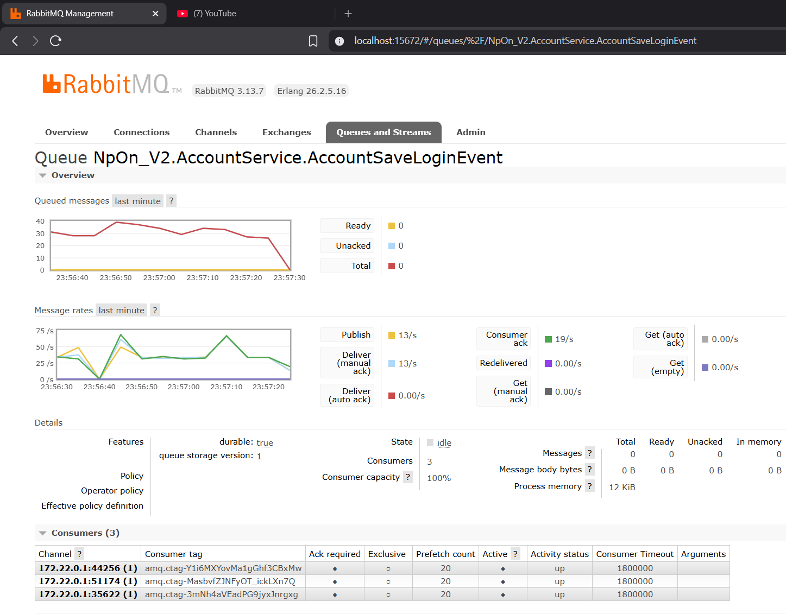

# NpOn.Net-V2 Core: Data Access Architecture in a Microservices Environment

This document outlines the custom-built Data Access Layer (DAL) and architectural decisions behind the `NpOn.Net-V2` Microservices core. Writing a framework from scratch usually involves balancing theoretical purity with practical trade-offs. Here, the goal was to separate business logic from database constraints, reduce reliance on third-party ORMs, and manage connections predictably within a microservices ecosystem.

---

## 1. Trade-offs: Microservices vs. Monoliths

Before diving into the core mechanisms, it is important to acknowledge the reality of the Microservices architecture. 

In terms of pure, raw execution speed, a well-optimized Monolithic application will frequently outperform Microservices because it avoids network serialization latency. Furthermore, distributed debugging and tracing can be quite complex. However, `NpOn.Net-V2` adopts Microservices primarily for **stability, isolation, and manageable scaling**. It allows independent teams to manage distinct business domains without introducing regressions into a single, massive codebase.

## 2. Centralized Query Management (Aligning with DDD)

A common challenge in evolving architectures is the tight coupling between Domain Logic and specific Database implementations (e.g., hardcoded SQL or vendor-specific Stored Procedures). 

`NpOn.Net-V2` mitigates this by abstracting the querying structure:
- **Centralized Mapping:** Execution contexts and query strings are managed centrally (often housed within the `GeneralService` boundaries), while the structural table layouts reside in the localized component databases (like `AccountService`).
- **Smooth Database Transitions:** If the infrastructure requires switching database dialects underlying a specific feature, developers primarily update the mapped query configurations in the central registry rather than rewriting C# domain functions. 
- **Maintainability:** For backups or migrations, one simply needs the centralized mapping tables and the lightweight schema structures of the components. This organized approach significantly speeds up deployment sequences and maintenance.

---

## 3. Connection Pool Management

To ensure stability across distributed services, the core utilizes `DbFactoryWrapper` and `IDbDriverFactory` to act as gatekeepers for database connections.

### Semaphore Connection Throttling
Connections are leased via `Factory.GetConnectionAsync()`, which is internally regulated by a `SemaphoreSlim`.
- **Handling Spikes:** By strictly gating connections, the system prevents unchecked connection escalation during traffic spikes. Excess requests queue asynchronously rather than immediately exhausting the database pool.
- **Graceful Release:** Following execution routines, the architecture explicitly forces the return of the leased connection (`ReleaseConnection`). This guarantees that resources are liberated reliably regardless of query outcomes or application-level exceptions, permanently preventing connection leaks.

---

## 4. Custom Data Mapping and Object Pooling

While libraries like Dapper are standard for mapping, `NpOn.Net-V2` leverages a custom mapping engine to carefully control memory allocation.

### Object Pooling
When dealing with large structured datasets, continuous memory instantiation creates heavy burdens on the Garbage Collector (GC). This core integrates Object Pooling, recycling the memory containers for mapped objects after they move through the pipeline, which effectively cuts down generational GC pressure.

### High-Performance Mapping via IL Emit
Standard Reflection is inherently slow due to metadata lookup costs. To address this, the mapper dynamically compiles execution delegates using **IL Emit** and **Expression Trees**. The first mapping operation incurs a one-time compilation overhead, but subsequent operations execute with throughput metrics comparable to native hardcoded property assignments.

---

## 5. The `INpOnResultSetWrapper` Abstraction

Data stores differ fundamentally in how they represent data (Relational vs. Wide-Column vs Key-Value). However, from an application perspective, a database is universally a system that receives a procedural command and returns a structured data node.

The framework encapsulates this concept into the `INpOnResultSetWrapper` interface.
- **Routing Engine:** It normalizes incoming structured payloads into a universal representation. The IL Emit mapping engine relies entirely on this interface, rendering it completely oblivious to the actual underlying database technology.
- **Extensibility:** Integrating a new Database engine merely requires writing a lightweight adapter that translates its native payload into this generic Wrapper. 
- **Current Support Status:** The abstraction is currently stable and operates smoothly with **PostgreSQL, Cassandra, Redis, and RabbitMQ**. Initial implementations for **Kafka** are integrated but are still undergoing flow refinements. Adaptations for **ElasticSearch** are planned as an ongoing work-in-progress.

---

## 6. Dual-Pipeline gRPC Communication

The framework establishes a highly robust structural network (`protobuf-net.Grpc`) dedicated to pipelining traffic dynamically without bottlenecking internal systems:
- **Internal Pipeline (S2S):** Core services communicate exclusively over HTTP/2 Binary pipelines. This circumvents slow JSON serialization completely, moving packed streams between servers at high speed. 
- **Public Pipeline (Gateways):** For edge services connecting to the outside world, the pipeline elegantly forks. It maintains standard HTTP/1.1 JSON REST APIs on default ports for seamless frontend integration, while simultaneously opening plain-text HTTP/2 (`h2c`) ports to support direct diagnostic operations (e.g., Postman) in staging environments.

---

## 7. Operational Benchmarks

The queuing and architectural mechanisms described above have demonstrated substantial stability under load. According to Management node metrics:

.png)
*(Message Rates maintaining smooth throughput in a Single-Node scenario)*

*(Message Rates showcasing strong consistency across a low-latency 3-Node Cluster).*

The system comfortably sustains intense throughput on baseline queues (e.g., `AccountSaveLoginEvent`) with dynamically distributed consumers, exhibiting zero dropped packet rates under parallel loading.

---

### Conclusion & Real-World Application

This architecture is not just theoretical; it functions as the operational backbone for an active **Healthcare (Nghiệp vụ Y tế)** software system in production. It safely handles the requisite isolation, massive data mapping, and continuous uptime demanded by the medical domain.

For developers looking to integrate or learn from this pattern: The persistence mechanics are fully laid out. You are encouraged to explore implementing distributed transaction mechanisms, such as the **Saga Pattern**, directly on top of these abstractions to gracefully dictate cross-service syncs and rollbacks.

**GitHub Repository:** 
[https://github.com/LeDucPr/NpOn.Net-V2](https://github.com/LeDucPr/NpOn.Net-V2)
